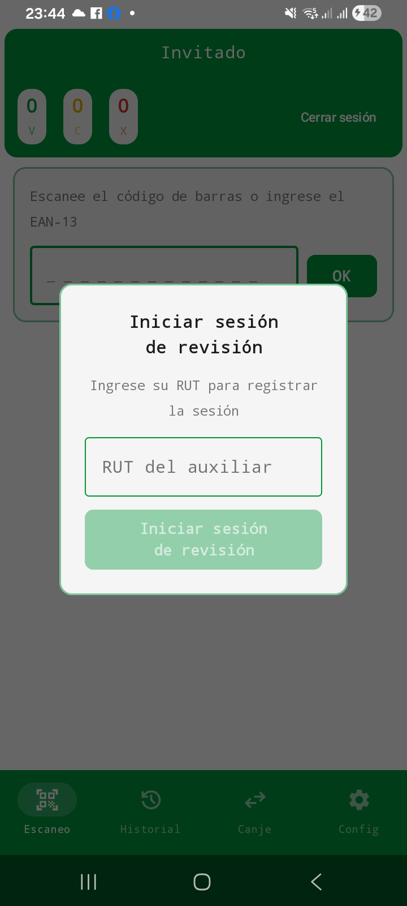
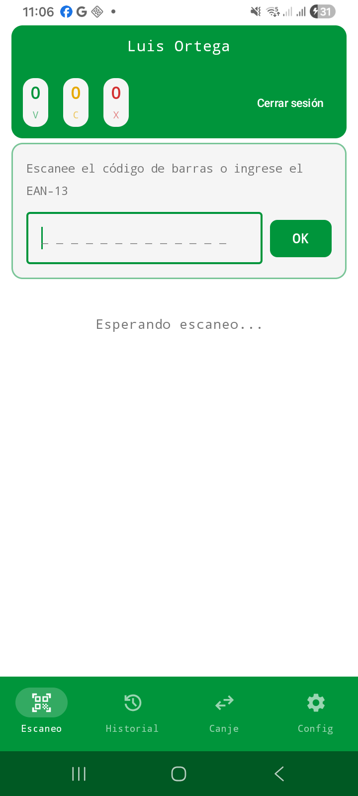
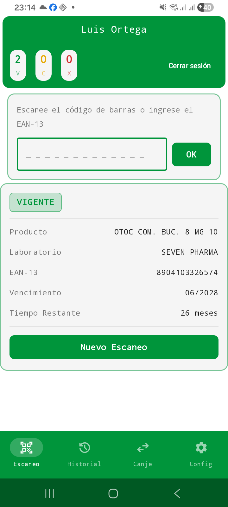

# PharmaDateCheck

### Sistema de control de vencimientos y gestión de políticas de canje farmacéutico


---

## Descripción

**PharmaDateCheck** es una aplicación móvil nativa para Android desarrollada en Kotlin como proyecto de Practica Profesional del programa de Ingeniería informática del Instituto Profesional IACC.

La aplicación automatiza el proceso de revisión, clasificación y gestión de medicamentos según su fecha de vencimiento y las políticas de canje vigentes de cada laboratorios, optimizando la eficiencia operacional del área de farmacia de la sucursal CV105 de farmacias Cruz Verde, ubicada en Rengo 601, Concepción, Chile.

El sistema clasifica cada medicamento escaneado en tres estados:

- ✅ **VIGENTE** — el producto se encuentra dentro de su periodo de validez
- ⚠️ **CANJEABLE** — El producto está p´roximo a vencer y es elegible para canje según la política del laboratorio
- ❌ **VENCIDO** — El producto ha superado su fecha de vencimiento y debe ser retirado del inventario

---

## Capturas de pantalla

| Inicio de sesión                                | Escaneo                                    | Resultado                                      |
|-------------------------------------------------|--------------------------------------------|------------------------------------------------|
|  |  |  |

---

## Stack Tecnológico

| Componente         | Tecnología                                           |
|--------------------|------------------------------------------------------|
| Lenguaje           | Kotlin                                               |
| UI                 | Jetpack Compose + Material Design 3                  |
| Arquitectura       | MVVM                                                 |
| Persistencia local | Room (SQLite)                                        |
| Concurrencia       | Kotlin Coroutines + Flow                             |
| Navegación         | Navigation Compose                                   |
| Captura HID        | Interceptación de eventos de teclado en MainActivity |

---

## Estructura del proyecto

```
app/src/main/java/com/lepeman/pharmadatecheck/
│
├── data/
│   ├── database/           # AppDatabase, Converters, AppContainer
│   ├── local/
│   │   ├── dao/            # 7 interfaces DAO (Room)
│   │   └── entities/       # 7 entidades Room
│   ├── offline/            # Implementaciones OfflineXxxRepository
│   └── repositories/       # Interfaces de repositorio
│
├── domain/
│   └── ClasificadorProducto.kt   # Motor de clasificación
│
├── ui/
│   ├── canje/              # Pantalla de gestión de políticas de canje
│   ├── config/             # Pantalla de configuración e importación CSV
│   ├── historial/          # Pantalla de historial de sesiones
│   ├── navigation/         # Grafo de navegación
│   ├── scan/               # Pantalla principal de escaneo
│   ├── theme/              # Paleta de colores, tipografía y tema
│   └── viewmodels/         # 4 ViewModels + AppViewModelProvider
│
├── DateCheckApplication.kt # Contenedor de dependencias
└── MainActivity.kt         # Punto de entrada, interceptación HID
```

---

## Modelo de dato

El modelo cuenta con 7 entidades Room relacionadas mediante claves foráneas:

```
Auxiliar ──────────────────────── SesionRevision
                                        │
                                        └──── ProductoRevisado
 
Laboratorio ──┬──────────────────── Producto
              └──────────────────── PoliticaCanje
                                        │
Empresa ─────────────────────────── PoliticaCanje
```

---

## Flujo de operación

```
1. Auxiliar ingresa RUT → autenticación
2. Escaneo con lector HID o entrada manual de EAN-13
3. Confirmación de fecha de vencimiento (MM/AAAA)
4. ClasificadorProducto determina el estado:
   → Sin política: VIGENTE o VENCIDO por fecha
   → Política inactiva: siempre VIGENTE
   → Mes de vencimiento en período de canje: CANJEABLE
   → Producto vencido con política activa: VENCIDO
5. Resultado registrado en base de datos local
6. Cierre de sesión con totales persistidos
```

---

## Estructura de ramas

El repositorio está organizado por Sprint para reflejar el avance iterativo del desarrollo:

| Rama       | Contenido                                              |
|------------|--------------------------------------------------------|
| `main`     | Código final completo del prototipo                    |
| `sprint-1` | Configuración inicial del proyecto                     |
| `sprint-2` | Capa de datos: entidades, DAOs y repositorios          |
| `sprint-3` | Motor de clasificación y pantalla de escaneo           |
| `sprint-4` | Historial, políticas de canje, configuración y pruebas |

---

## Metodología de desarrollo

El proyecto siguió la metodología **Scrum** con 4 Sprints de una semana cada uno:

- **Sprint 1** — Análisis del proceso actual, definición de requerimientos, diseño de arquitectura y modelo de datos.
- **Sprint 2** — Implementación completa de la capa de datos: 7 entidades Room, 7 DAOs, 7 repositorios y prepoblado automático.
- **Sprint 3** — Motor de clasificación (`ClasificadorProducto`), integración HID, autenticación por RUT y pantalla de escaneo.
- **Sprint 4** — Pantalla de historial, gestión de políticas de canje con autocompletado, importación CSV y pruebas funcionales.

---

## Contexto Académico

| Campo              | Detalle                                                      |
|--------------------|--------------------------------------------------------------|
| Institución        | Instituto Profesional IACC                                   |
| Programa           | Ingeniería Informática                                       |
| Asignatura         | Práctica Profesional                                         |
| Centro de práctica | Farmacias Cruz Verde — Sucursal CV105, Rengo 601, Concepción |
| Autor              | Luis Andrés Ortega Lepe                                      |
| Fecha de entrega   | Abril 2026                                                   |

## Licencia

Este proyecto fue desarrollado con fines exclusivamente académicos en el marco de la Práctica Profesional del programa de Ingeniería Informática del Instituto Profesional IACC. No está autorizada su reproducción, distribución ni uso comercial sin autorización expresa del autor.

© 2026 Luis Andrés Ortega Lepe. Todos los derechos reservados.